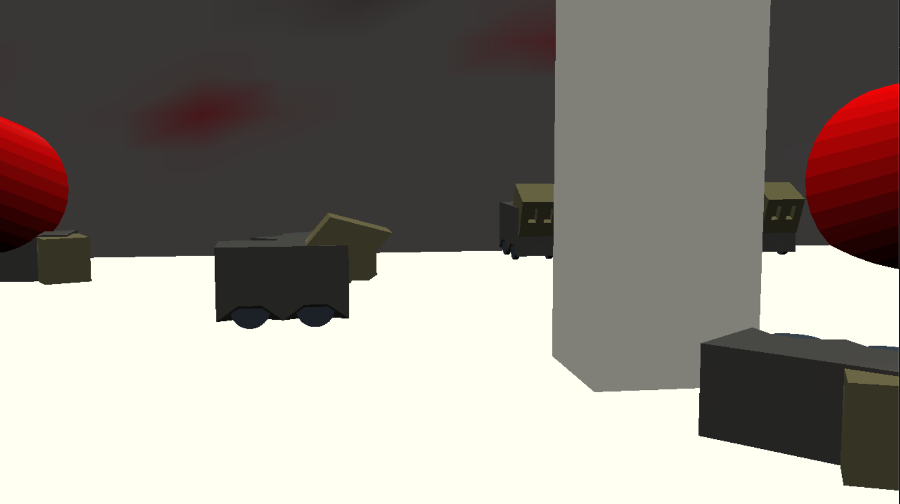

# Perilous Escape

Author: Woody McCoy

Design: This is a game about being a robot, who must carefully move to escape a labratory. Sound cues are essential to knowing when it's safe to move!

Screen Shot:

How To Play:

Press and hold space to move forward, and release space to stop. Do not move when the spotlights are on your character, and use the music cues to know when they'll move onto you.

Sources: N/A

This game was built with [NEST](NEST.md).

